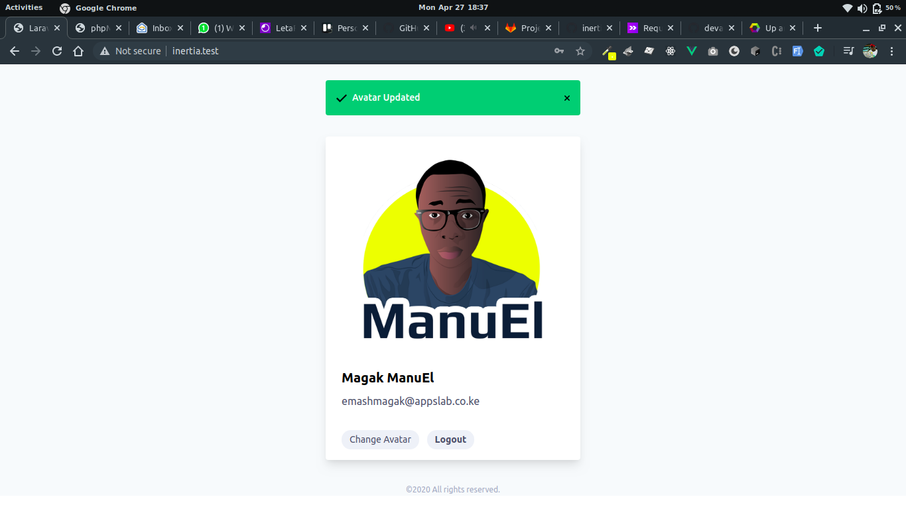

## About Phoenix Inertia

 This is a sample Laravel project to illustrate Creating SPA with Inertia JS
 
 ## Table of contents
 - [Set Up](#set-up)
 - [Features](#features)
 - [Screenshot](#screenshot)
 - [Resources](#resources)
 - [About Me](#about-me)
 - [Licence](#licence)

## Set Up
Fork and Clone the project;

To start your Phoenix server:

  * Install dependencies with `mix deps.get`
  * Create and migrate your database with `mix ecto.setup`
  * Install Node.js dependencies with `cd assets && npm install`
  * Start Phoenix endpoint with `mix phx.server`

Now you can visit [`localhost:4000`](http://localhost:4000) from your browser.

Ready to run in production? Please [check our deployment guides](https://hexdocs.pm/phoenix/deployment.html).

## Features 

* Register
* Login
* Update Avatar
* CRUD
* Pagination

## Screenshot

## Resources

 - [Inertia](https://inertiajs.com/)
 - [Phoenix Inertia](https://github.com/devato/inertia_phoenix)
 - [Vue Js Inertia](https://github.com/inertiajs/inertia-vue)

## About Me

[Magak Emmanuel](https://magak.me)

## License

Happy coding, Star before Fork 😊💪💯

